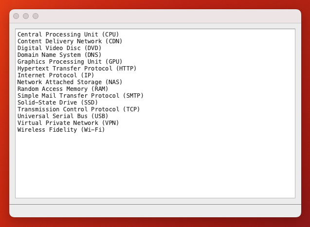

# Listie

A simple text editor optimized for sorted lists. 

I wrote this to keep track of acronyms and terminology usage while writing or editing long documents.

Based on the [No2Pads, a simple Notepad clone](https://www.pythonguis.com/examples/python-notepad-clone/) tutorial by Martin Fitzpatrick.